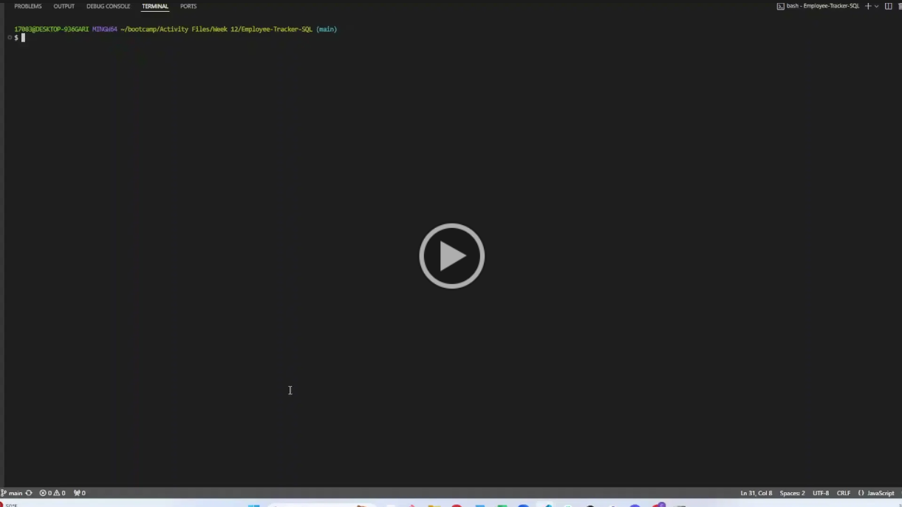

  
# Employee-Tracker-SQL

  
   
  
  
  
  
  

  

## Description
This application is solely initialized from the terminal. It gives the user the ability to input information about their company/employees. The user can choose to see the data tables on departments, roles, and their employees. This app allows user to add new department information, role information, and new employees. If an employee's role changes, the user can also update that information.

This application shows my new knowledge on SQL: postgresql, and Sequelizee.js; while also building on my knowledge of previous topics covered.

## Usage
Watch Employee Tracker Demo Here:

---

## License

This project is covered by the MIT license.

## Credits

* Help from Xpert and chatGPT catching my syntax, logic errors!
